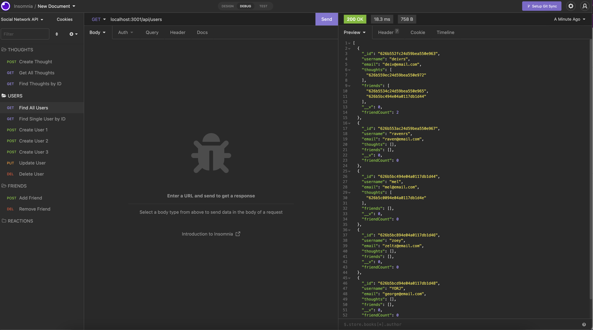

# ubiquitous-umbrella-social-network-API# Social Network API
  
  
  ## Table of Contents ##
  *[Description](#description)

  *[License](#license)

  *[Languages](#languages)

  *[Installation](#installation)

  *[Usage](#usage)

  *[Contributing](#contributing)

  *[Questions](#questions)

  ## Link to Video Walkthrough ##
  https://drive.google.com/file/d/1VEBRkIxcJ3UUSabsE4aqpw_tf1l1xI9P/view

  ## Description ##
  A Social Network back-end API where users can share thoughts, react to friends' thoughts, and create a friend list. It is created using a NoSQL database in order to handle large amounts of unstructured data! 
  

  ## License ##
  This is licensed under MIT
  

  ## Installation ##
  npm i

  ## Tests ##
  npm test

  ## Usage ##
  There's code in here! It's fragile

  ## Contributing ##
  Nothing. Feel free to make it better!

  ## Questions ##
  Github: [DEIVRS60](https://github.com/DEIVRS60)

  Email: david.reyes095@gmail.com

  
